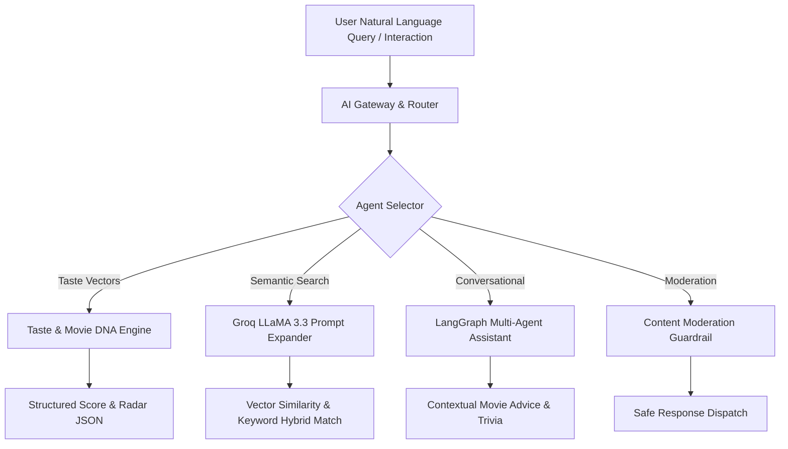

<div align="center">

# 🎬 CineVerse

### Production-Grade AI-Powered Cinematic Intelligence Platform

[](LICENSE)
[](https://www.typescriptlang.org/)
[](https://nextjs.org/)
[](https://react.dev/)
[](https://www.postgresql.org/)
[](https://www.prisma.io/)
[](https://www.docker.com/)
[](https://aws.amazon.com/)
[](https://github.com/features/actions)
[](CONTRIBUTING.md)
[](https://github.com/shouryapratap132006/cineverse/stargazers)
[](https://github.com/shouryapratap132006/cineverse/network/members)
[](https://github.com/shouryapratap132006/cineverse/issues)

<p align="center">
  <b>CineVerse</b> is an open-source, full-stack cinematic platform leveraging multi-agent AI orchestrators (Groq LLaMA 3.3 70B & LangGraph), real-time interactive watch parties, vector taste profiling ("Movie DNA"), and semantic movie discovery.
</p>

[Explore Features](#-features) • [AI Architecture](#-ai-features) • [Local Setup](#-local-setup) • [Documentation](docs/ARCHITECTURE.md) • [Contributing](CONTRIBUTING.md)

</div>

---

## 📌 Introduction

**CineVerse** bridges high-performance streaming UI with cutting-edge artificial intelligence. Designed for movie enthusiasts, film critics, and developer communities, CineVerse offers an immersive experience where AI doesn't just recommend movies—it understands taste profiles, generates visual genome radar charts, conducts multi-agent movie assistant conversations, and coordinates synchronized live watch parties with real-time WebSocket communication.

Built using **Next.js 16 (App Router)**, **React 19**, **Prisma ORM**, **Neon PostgreSQL**, **Clerk Auth**, **Groq AI**, **Socket.IO**, **Stripe**, and containerized with **Docker** for **AWS EC2/Caddy** deployment.

---

## ✨ Features

- 🎭 **Movie DNA Taste Profiling**: Multi-dimensional radar matrix analyzing user affinity across mood, pacing, narrative complexity, visual style, and thematic elements.
- 💬 **Real-Time Watch Parties & Chat**: Multi-user sync room rooms powered by custom HTTP + Socket.IO server & Pusher channels fallback.
- 💳 **Stripe Subscription Tier Management**: Seamless Free vs. CineVerse Pro tier upgrades, usage quotas, and billing management.
- 🔐 **Clerk Enterprise Authentication**: Webhook-driven user syncing to Prisma PostgreSQL with protected server action guards.
- 🖼️ **Cloudinary Media Assets**: Optimized image storage, poster rendering, and user profile avatar processing.
- ⚡ **TMDB Proxy Caching**: High-throughput proxy layer wrapping TMDB v3 API with rate-limit protection and fallback data.

---

## 🧠 AI Features

CineVerse embeds a sophisticated multi-agent intelligence pipeline:



1. **LangGraph Multi-Agent Orchestration**: Agent state machine handling multi-turn conversational inquiries, context persistence, and intent routing.
2. **Groq LLaMA 3.3 70B Acceleration**: Ultra-low latency LLM inference producing sub-second recommendations and movie summaries.
3. **Semantic Query Expander**: Translates natural language prompts like *"Moody cyberpunk thrillers with melancholic electronic synth scores"* into precise filter parameters.
4. **Interactive AI Movie Assistant**: Real-time film recommendations with explanations of *why* a film matches your profile.
5. **AI Content Moderation**: Guardrails filtering community reviews and public chat channels.

---

## 🏗️ Architecture

```mermaid
graph TB
    subgraph Client Layer
        Web[Next.js 16 Web Application / React 19 UI]
        SocketClient[Socket.IO Client]
    end

    subgraph Server & Proxy Layer
        Caddy[Caddy Reverse Proxy / HTTPS]
        Server[Custom Express + Socket.IO + Next Server]
    end

    subgraph Business Logic & AI Layer
        Auth[Clerk Authentication Middleware]
        AIGateway[Groq & LangGraph AI Orchestrator]
        TMDB[TMDB Proxy & Cache]
    end

    subgraph Data & Storage Layer
        DB[(Neon PostgreSQL / AWS RDS)]
        Prisma[Prisma ORM 7]
        Cloudinary[Cloudinary Media CDN]
    end

    Client Layer --> Caddy
    Caddy --> Server
    Server --> Auth
    Server --> AIGateway
    Server --> TMDB
    Server --> Prisma
    Prisma --> DB
    Server --> Cloudinary
```

---

## 🛠️ Tech Stack

| Domain | Technologies |
| ------ | ------------ |
| **Frontend Framework** | [Next.js 16](https://nextjs.org/) (App Router), [React 19](https://react.dev/), [TypeScript 5](https://www.typescriptlang.org/) |
| **Styling & UI** | [Tailwind CSS v4](https://tailwindcss.com/), [Framer Motion 12](https://framer.com/motion), [Lucide React](https://lucide.dev/), [Radix UI](https://www.radix-ui.com/) |
| **AI & LLM** | [Groq SDK](https://groq.com/) (LLaMA 3.3 70B), [LangGraph](https://langchain-ai.github.io/langgraph/), [Zod Schema Validation](https://zod.dev/) |
| **Database & ORM** | [Prisma 7](https://www.prisma.io/), [PostgreSQL](https://www.postgresql.org/) (Neon / AWS RDS) |
| **Authentication** | [Clerk Auth](https://clerk.com/) |
| **Real-Time Websockets** | [Socket.IO 4](https://socket.io/), [Pusher Channels](https://pusher.com/) |
| **Payments** | [Stripe SDK](https://stripe.com/) |
| **Infrastructure & CI/CD** | [Docker](https://www.docker.com/), [AWS EC2](https://aws.amazon.com/), [Caddy Server](https://caddyserver.com/), [GitHub Actions](https://github.com/features/actions) |

---

## 📸 Screenshots & Demo

*(Add your high-resolution UI screenshots here)*

- **Discover & AI Recommendations Dashboard**: Dynamic film carousels with AI confidence ratings.
- **Movie DNA Radar Chart**: Visual breakdown of mood, tempo, and complexity metrics.
- **Live Watch Party & Real-Time Chat**: Synchronized viewing lounge with interactive chat controls.

---

## ⚡ Deployment

CineVerse is pre-configured for automated continuous deployment to **AWS EC2** using **Docker** and **GitHub Actions**:

- **CI/CD Pipeline**: `.github/workflows/deploy.yml` builds production multi-stage Docker images and pushes to **GHCR**.
- **Server Deployment**: Automated SSH deployment triggering zero-downtime updates with `docker-compose.ghcr.yml` and **Caddy** auto-TLS SSL management.

Read full deployment details in [docs/DEPLOYMENT.md](docs/DEPLOYMENT.md).

---

## 🚀 Local Setup

Follow these steps to get CineVerse running locally in under 15 minutes:

### Prerequisites
- Node.js v20+
- npm v10+
- PostgreSQL database instance (or local Docker container)

### Step 1: Clone Repository
```bash
git clone https://github.com/shouryapratap132006/cineverse.git
cd cineverse
```

### Step 2: Install Dependencies
```bash
npm install
```

### Step 3: Configure Environment Variables
```bash
cp .env.example .env
```
Edit `.env` and fill in your keys (Database URL, Clerk Auth, Groq API key, TMDB key).

### Step 4: Run Database Migrations
```bash
npm run prisma:generate
npm run prisma:migrate
```

### Step 5: Start Local Development Server
```bash
npm run dev
```
Open [http://localhost:3000](http://localhost:3000) in your browser.

---

## 🔑 Environment Variables

| Variable | Description | Required |
| -------- | ----------- | -------- |
| `DATABASE_URL` | PostgreSQL connection string | Yes |
| `NEXT_PUBLIC_CLERK_PUBLISHABLE_KEY` | Clerk Auth public publishable key | Yes |
| `CLERK_SECRET_KEY` | Clerk Auth server secret key | Yes |
| `NEXT_PUBLIC_TMDB_API_KEY` | TMDB API v3 key | Yes |
| `GROQ_API_KEY` | Groq AI platform secret key | Yes |
| `NEXT_PUBLIC_APP_URL` | Canonical app URL (e.g. `http://localhost:3000`) | Yes |
| `STRIPE_SECRET_KEY` | Stripe billing API key | Optional |
| `CLOUDINARY_CLOUD_NAME` | Cloudinary storage tenant | Optional |

See [.env.example](.env.example) for the full annotated specification.

---

## 📂 Folder Structure

```
cineverse/
├── .github/              # Issue/PR templates, CI/CD workflows
├── prisma/               # Schema definitions, migrations, seed scripts
├── public/               # Static web assets & icons
├── scripts/              # Infrastructure and deployment automation
├── src/
│   ├── actions/          # Server Actions (Auth, Watchlist, Ratings)
│   ├── ai/               # Groq & LangGraph multi-agent services
│   ├── app/              # Next.js 16 App Router pages & API routes
│   ├── components/       # Reusable UI component design system
│   ├── hooks/            # Custom React hooks & state
│   └── lib/              # Database clients, utilities, TMDB proxy
├── docs/                 # Enterprise documentation hub
├── wiki/                 # GitHub Wiki documentation modules
├── Dockerfile            # Multi-stage production container build
├── docker-compose.yml    # Orchestration configuration
├── server.ts             # Custom Express + Socket.IO + Next server
└── package.json          # Dependency manifest & dev scripts
```

---

## 🔌 API Overview

CineVerse exposes clean Next.js Server Actions and REST API routes:

- `POST /api/webhooks/clerk` - Clerk user creation and update synchronization.
- `POST /api/webhooks/stripe` - Stripe subscription event handling.
- `GET /api/tmdb/[...path]` - Cached proxy client for TMDB metadata.
- `POST /api/ai/recommend` - Groq AI streaming recommendation endpoint.
- `POST /api/ai/chat` - LangGraph multi-agent conversational interface.

Detailed documentation: [docs/API_REFERENCE.md](docs/ARCHITECTURE.md).

---

## 🗄️ Database Schema

The database model is defined via Prisma in `prisma/schema.prisma`. Key tables include:

- `User` - Primary user identity synced with Clerk auth.
- `TasteProfile` - Quantitative movie preference vector & radar scores.
- `Watchlist` & `WatchlistItem` - User movie collections.
- `Review` & `Rating` - Community reviews with AI moderation status.
- `WatchParty` & `WatchPartyParticipant` - Real-time sync room states.
- `Subscription` - Stripe billing subscription status.

Full ER diagram and details: [docs/DATABASE_SCHEMA.md](docs/DATABASE_SCHEMA.md).

---

## 🤝 Contributing

We ❤️ open source contributors! Whether you want to fix a bug, enhance the AI engine, improve UI accessibility, or add tests:

1. Read our [Contributing Guide](CONTRIBUTING.md).
2. Check out [Good First Issues](docs/issues/GOOD_FIRST_ISSUES.md) or [Help Wanted Issues](docs/issues/HELP_WANTED_ISSUES.md).
3. Follow the [Code of Conduct](CODE_OF_CONDUCT.md).

---

## 🗺️ Roadmap

See our detailed [ROADMAP.md](ROADMAP.md) for upcoming milestones, in-progress tasks, and community feature votes.

---

## 📄 License

CineVerse is open-source software licensed under the **[MIT License](LICENSE)**.

---

## 👥 Contributors

Thank you to all our amazing contributors!

<a href="https://github.com/shouryapratap132006/cineverse/graphs/contributors">
  
</a>

---

<div align="center">
  Made with ❤️ by the CineVerse Open Source Community.
</div>