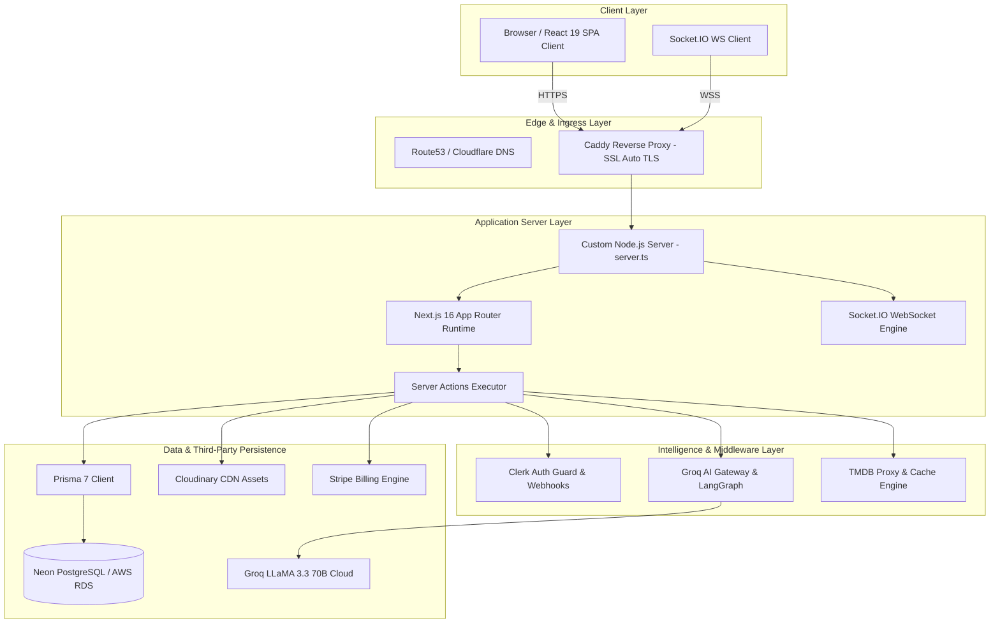

# CineVerse Architecture Overview

This document provides a comprehensive technical breakdown of the architecture, component interaction, data flow, and design principles of **CineVerse**.

---

## 🏛️ Overall System Architecture

CineVerse uses a modern hybrid micro-service monolith architecture. The frontend application, Server Actions, and WebSockets reside in a unified Next.js 16 runtime deployed alongside a custom Express + Socket.IO server, integrated with managed cloud services (Neon PostgreSQL, Clerk Auth, Groq AI, Cloudinary, Stripe).

---

## 🔄 Core Request Lifecycle

1. **Client Request Ingress**: Incoming HTTP/HTTPS requests hit **Caddy** on port 80/443, which terminates TLS and reverse proxies traffic to port 3000 (`server.ts`).
2. **Middleware Evaluation**: `src/middleware.ts` executes Clerk session verification. Unauthenticated requests to protected dashboard routes are redirected to `/auth/sign-in`.
3. **Data Fetching & Server Actions**: React Server Components query Prisma directly, or trigger type-safe Server Actions (`src/actions/*`) for mutations.
4. **AI Intelligence Execution**: AI queries route through `src/ai/gateway.ts`, invoking Groq LLaMA 3.3 70B via low-latency HTTP streaming or LangGraph multi-turn agent state machines.
5. **Real-time Broadcast**: Event mutations (e.g. watch party message) trigger Socket.IO room broadcasts to all connected WebSocket clients.

---

## 🔒 Security & Resilience Architecture
- **Environment Isolation**: Secrets are kept server-side; client components only access variables prefixed with `NEXT_PUBLIC_`.
- **Database Connection Pooling**: Prisma 7 utilizes `@prisma/adapter-pg` and pooled Neon connection URIs to prevent connection exhaustion.
- **Rate-Limit Safeguards**: The TMDB proxy client wraps upstream TMDB API calls with exponential backoff and caching to respect rate limits.
