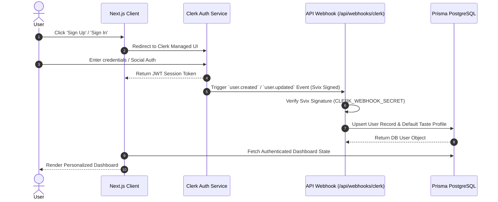

# Authentication & User Synchronization Flow

CineVerse uses **Clerk Authentication** for enterprise-grade security, supporting social logins (Google, GitHub), magic links, and passkeys, tightly synced with our **Prisma PostgreSQL** database via webhooks.

---

## 🔁 Authentication Sequence Diagram



---

## 🛡️ Route Protection Middleware (`src/middleware.ts`)

```typescript
import { clerkMiddleware, createRouteMatcher } from '@clerk/nextjs/server';

const isPublicRoute = createRouteMatcher([
  '/',
  '/auth(.*)',
  '/api/webhooks(.*)',
  '/api/tmdb(.*)'
]);

export default clerkMiddleware(async (auth, req) => {
  if (!isPublicRoute(req)) {
    await auth.protect();
  }
});
```

---

## 🔄 User Identity Synchronization
When a user registers or updates their profile via Clerk:
1. Clerk emits a webhook payload signed with a Svix header.
2. `/api/webhooks/clerk` validates the Svix signature using `CLERK_WEBHOOK_SECRET`.
3. An upsert query creates or updates the `User` record in PostgreSQL and initializes a blank `TasteProfile` vector.
