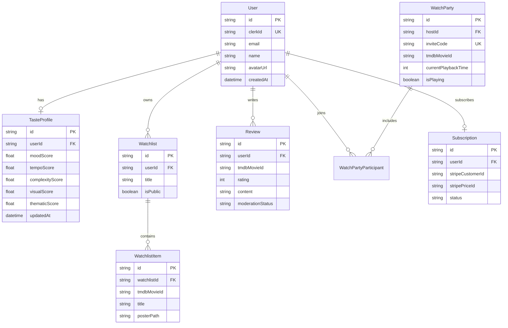

# Database Schema & Data Models

CineVerse utilizes **Prisma ORM 7** targeting PostgreSQL (Neon / AWS RDS).

---

## 🗄️ Entity-Relationship (ER) Diagram

```mermaid
erDiagram
    User ||--o| TasteProfile : "has"
    User ||--o{ Watchlist : "owns"
    User ||--o{ Review : "writes"
    User ||--o{ WatchPartyParticipant : "joins"
    User ||--o| Subscription : "subscribes"
    
    Watchlist ||--o{ WatchlistItem : "contains"
    WatchParty ||--o{ WatchPartyParticipant : "includes"

    User {
        string id PK
        string clerkId UK
        string email
        string name
        string avatarUrl
        datetime createdAt
    }

    TasteProfile {
        string id PK
        string userId FK
        float moodScore
        float tempoScore
        float complexityScore
        float visualScore
        float thematicScore
        datetime updatedAt
    }

    Watchlist {
        string id PK
        string userId FK
        string title
        boolean isPublic
    }

    WatchlistItem {
        string id PK
        string watchlistId FK
        string tmdbMovieId
        string title
        string posterPath
    }

    Review {
        string id PK
        string userId FK
        string tmdbMovieId
        int rating
        string content
        string moderationStatus
    }

    WatchParty {
        string id PK
        string hostId FK
        string inviteCode UK
        string tmdbMovieId
        int currentPlaybackTime
        boolean isPlaying
    }

    Subscription {
        string id PK
        string userId FK
        string stripeCustomerId
        string stripePriceId
        string status
    }
```
