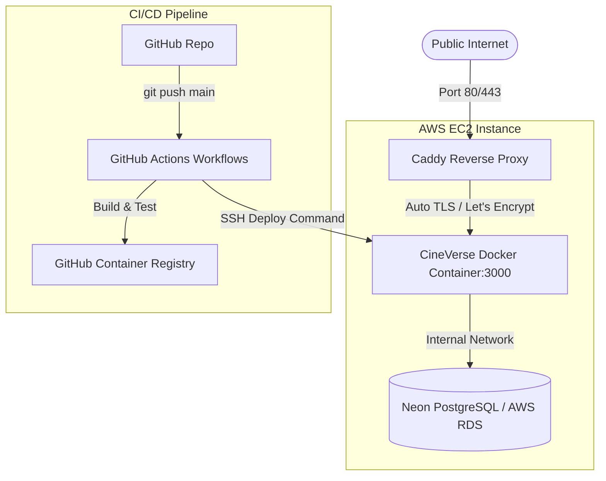

# Enterprise AWS Deployment Guide

This document details the production deployment architecture for **CineVerse** on **AWS EC2** using **Docker**, **Caddy Server**, and **GitHub Actions**.

---

## 🌐 Production Topology Diagram



---

## 🚀 Deployment Prerequisites
- AWS EC2 Instance (t3.medium or larger recommended).
- Elastic IP address attached to EC2.
- Domain DNS pointing A record to Elastic IP.
- GHCR secret tokens set in GitHub Repository Secrets (`EC2_HOST`, `EC2_USERNAME`, `EC2_SSH_KEY`).

---

## 🛠️ Execution Sequence (`scripts/deploy.sh`)

```bash
#!/bin/bash
set -e

echo "==> Pulling latest Docker image from GHCR..."
docker pull ghcr.io/shouryapratap132006/cineverse:latest

echo "==> Running Prisma Database Migrations..."
docker run --rm --env-file .env ghcr.io/shouryapratap132006/cineverse:latest npx prisma migrate deploy

echo "==> Restarting Production Containers..."
docker-compose -f docker-compose.ghcr.yml up -d --remove-orphans

echo "==> Deployment Complete!"
```
