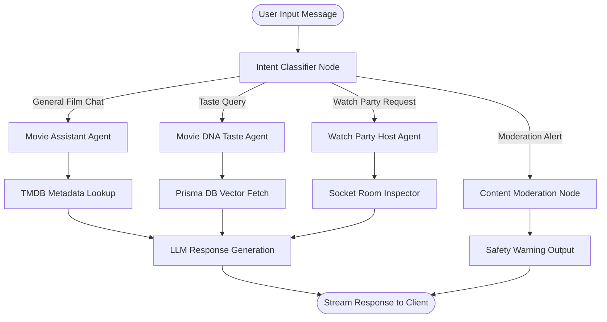

# LangGraph Multi-Agent Workflow

CineVerse uses **LangGraph** to coordinate multi-agent conversations, complex multi-step film research, and intent-based agent routing.

---

## 🤖 Agent Topology & Graph Diagram



---

## ⚙️ LangGraph State Schema (`src/ai/orchestrator.ts`)

```typescript
import { StateGraph, END } from '@langchain/langgraph';

export interface AgentState {
  messages: Array<{ role: 'user' | 'assistant' | 'system'; content: string }>;
  userId: string;
  intent?: 'recommend' | 'taste' | 'watchparty' | 'general';
  movieContext?: any[];
  safetyCheckPassed: boolean;
}
```
