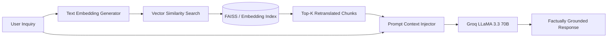

# RAG (Retrieval-Augmented Generation) Pipeline

CineVerse uses a **RAG Pipeline** to ground AI responses in verified film trivia, cast filmographies, and curated director notes.

---

## 📐 RAG Flow Diagram

---

## 💡 Vector Index & Embeddings Strategy
- **Embedding Model**: OpenAI `text-embedding-3-small` / HuggingFace All-MiniLM-L6-v2.
- **Chunking Strategy**: Film trivia and plot summaries are chunked into 512-token segments with 50-token overlap.
- **Context Injection**: Relevant chunks are formatted into markdown blocks inside the system prompt before LLM invocation.
