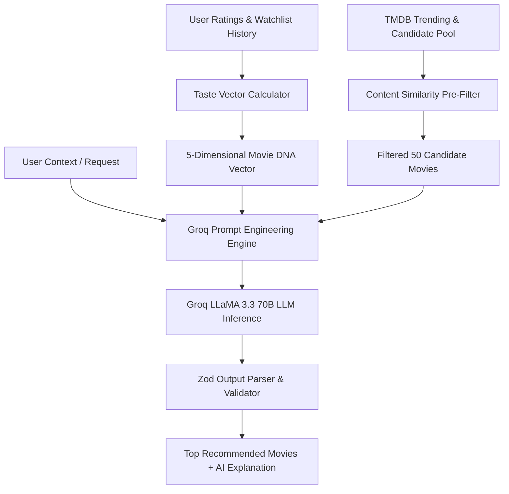

# Hybrid AI Recommendation Engine

CineVerse combines algorithmic taste vector scoring with Large Language Model (Groq LLaMA 3.3 70B) reasoning to deliver personalized, explainable movie recommendations.

---

## ⚙️ Recommendation Pipeline Diagram

---

## 🧮 Taste Vector Weighting Formula

The recommendation engine calculates match confidence \(M\) between a user's Movie DNA vector \(\vec{U}\) and a candidate movie's feature vector \(\vec{M}\):

\[
M(\vec{U}, \vec{M}) = w_1 \cdot \text{CosineSimilarity}(\vec{U}_{\text{genre}}, \vec{M}_{\text{genre}}) + w_2 \cdot (1 - |\vec{U}_{\text{tempo}} - \vec{M}_{\text{tempo}}|) + w_3 \cdot S_{\text{mood}}
\]

Where:
- \(w_1 = 0.40\) (Genre affinity weight)
- \(w_2 = 0.30\) (Pacing / Tempo weight)
- \(w_3 = 0.30\) (Mood & visual complexity weight)

---

## 🤖 LLM Explanation Synthesis
Groq LLaMA 3.3 evaluates the candidate set alongside the user's recent highly rated films to output a structured JSON response containing:
- `movieId`: Unique identifier.
- `matchPercentage`: Calculated match score (80% - 99%).
- `aiReasoning`: Human-readable 2-sentence explanation of why this movie fits their current taste profile.
